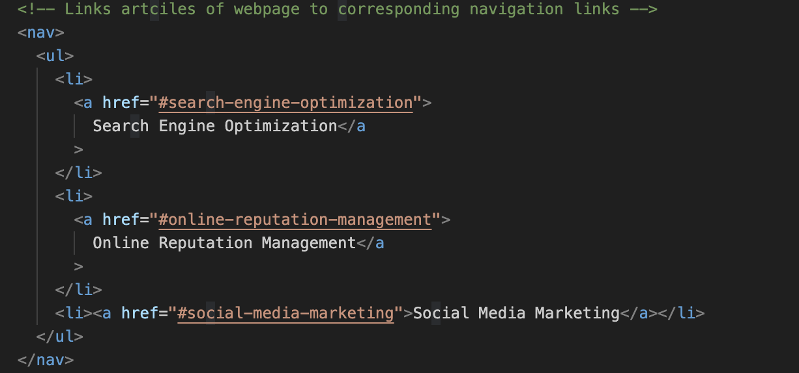
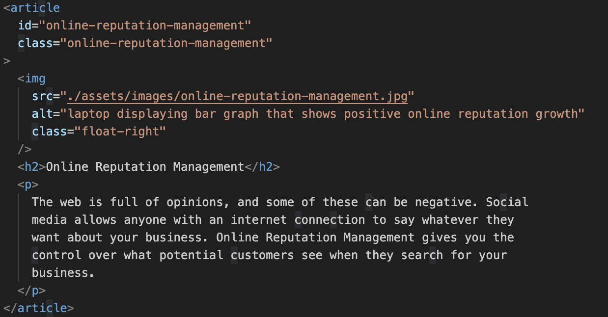
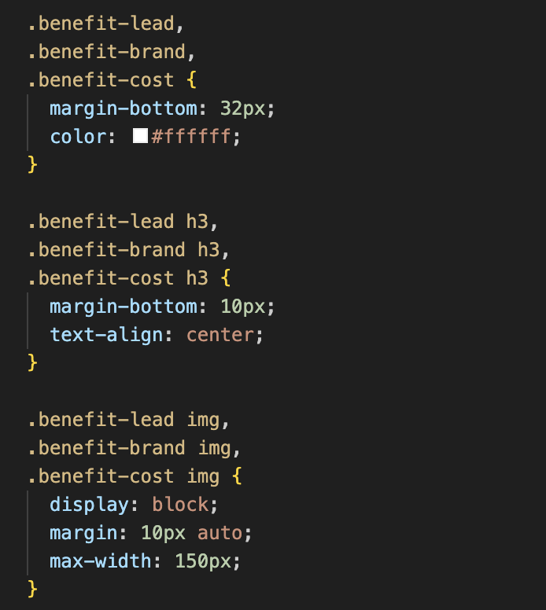

# <Module-1-Challege-KP>

## Description

The main objective of this project was to refactor a code base to improve accessibility. HTML was refactored to include semantic elements to improve readability. Alt text was added to images for screen readers. CSS was refactored to dry code, including combining repetitive class selectors that included the same styling elements. Comments were added to HTML and CSS code to explain functionality. Additionally, broken navigation links were repaired.

## Screenshots

### Semantic html tags such as "nav" were added to imporove readabilty.

### Alt text was added to images for screen readers.

### CSS class selectors with same styling elements were combined.

## Deployed Application

### Application URL

https://karapoole.github.io/module-1-challenge-kp/

### Application Screenshot

## License

Please refer to the LICENSE in the repo.
